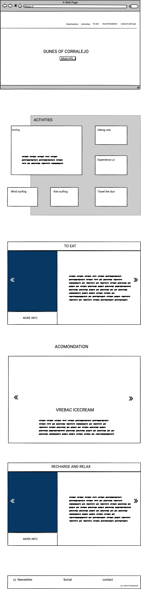

### MILESTONE PROJECT 2

Table of content

-Project overview

-Project balsamiq wireframe

-UX

-Section overview

-Futeres possible to Implement

-Technologies Used

-Deployment

-HTML sources

-Credits

-Content

-Media

-Acknowledgements

### Project balsamiq wireframe

## Project overview

Website purpose and information

Milestone project 2 is one of suggestet topics from code institute oabout turist information website.
The subject of created website is fuerteventura island with variety of 
thngs to do, eat and accomodation. 
Project is created in most easy and redable way with simple menu and scrooling thru website sections. My purpose was to create easies navigated website thru which user can get thru all the info easies way possible.

UX

Potencial user who want to get some information in the short time can go thru top menu or simply scrooling down thru website sections. Using carusels of chosen subjects. On the last section footer menu, we also have possibility to sign for a newsleter with new informations about freshly added activiies options or places to stay or eat. Next we have social links and contact info..

Project starts with simple menu  with list when clicked redirecting us to website sections that are most interested for us in given moment.

Menu bar contains 4 elements with topics most interested for every person who wish to be able to get straight information about what interesting us the most. 

Pointing over menu list items are delicate highlighted informing us wich section we are about to choose.

Choosing option activities from menu,  we are redirected to information about activities wich cand we choose from. Either potencial user is already there or just looking for info to choose and decide if Fuereventura is interested place to go to. That section can help to provide information and help to decide if we can find some interesting activities during our stay. 

Scroling further down or choosing from top menu bar we are landing on section "To eat". On this section user have posibility to choose form recomended restaurants with blend of different cousines. Pointing over suggested restaurant photo with mouse pointer coursor, User will see text to click on photo to show location of the restaurant on the map.

Next in line while scroling dow on the map we have "Accommodation" section.
Wich work exacly the same as above "To eat section. User has oportunity to get information about best places to stay. And agin crosing over and clicking "Click to show n the map user have posibillity to locate suggested accomodation place. 

Last section Footer menu contains posibbility to sign up to website Newsletter wheere we can provide useful news about places to stay, eat or new possible activities to spend time on island. Next we have social links icons wich clicked redirecting us straight chosen social media websites. Lastly "Contact" option where under Contact user can click for info.

Futures possible to Implement:

Website is constructad for implementation of new sugestion and recomendations for potential users. Destinations is one choice from main menu with more and more destinations to visit on the island. Different cities or regions may be added to vist fuerte. There is posibility in building up Main menu with new sugestions subjects, for example, leisure and spa, night life and many others.

To all three sections: Activities, to eat  accomoddation we can simply ad new futures, implement more detailed information, contact, phone number or redirecting buttons to the web sites for potencial reservation. 

Footer as well as the rest of the website has options to build up with more information and choicec of contact form.

### Technologies Used

HTML, CSS, BOOTSTRAP, JAVA, and JQUERRY

Code Parts used from Bootstrap.com

Navbar,
Section 2, Activities using java
Section 3, Carousel
Section 4, Carousel
Section 3  Using google maps api.
Section 4  Using google maps api.
Footer newsletter modal.
Footer contact modal. 

Html code using bootstrap modals and temlates.
Added clases, paragraph and code parts.
Css code mostly writen by author, with sources from 
w3schools.com
youtube.com
google com.
other websites. 

### Media used

In the project were used media from Adobe stock.
Previews of photos with watermarks easy visible.
Information and descriptions about suggested places to eat or favorit sugestions of accomondation are random, used just for school project pourpose.

### Testing

Html css tests:
W3c validator
W3c css validator

Tested Devices:
Iphone 7
Iphone 7 plus
Iphone X
Ipad
samsung tab 4
Tested browsers:
Google chrome
Safari
Mozilla
Tested futures:
Navbar
Navbar button

### social media links (Footer)

facebook.com
instagram.com
linkedin.com
youtube.com

### Deployment

Website content deployed on - gitpages
To open website copy link below.
Website gitpages link: https://bartie1982.github.io/bartie-milestoneproject-2/
Project source code on github.
Github link: https://github.com/Bartie1982/bartie-milestoneproject-2

### Credits

www.codeinstitute.net
www.github.com
www.getboootstrap.com
www.balsamiq.com
www.geeksforgeeks.org
www.w3schools.com
Content
Text for all the website sections: 
To eat: La jaira by Demain (info form: https://www.lonelyplanet.com/) 
To eat: A poniete gastro bar (info from https://macaronesiafuerteventura.com/)
Accommodation: MINIMALIST VILLA WITH GREAT VOLCANO VIEW (tripadvisor.com)
Acommodation: VOLCANIC HOUSE IN FUERTAVENTURA (tripadvisor.com)
Acommodaton: Sunrise VILLA (Webb google search)
Used help from fb pages.
All media and info used  personaly for purpose of School project use.

MIT © Bartosz Szkaradzinski